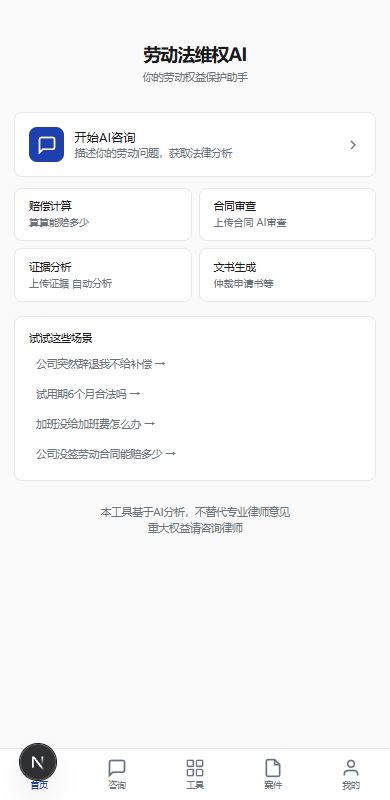
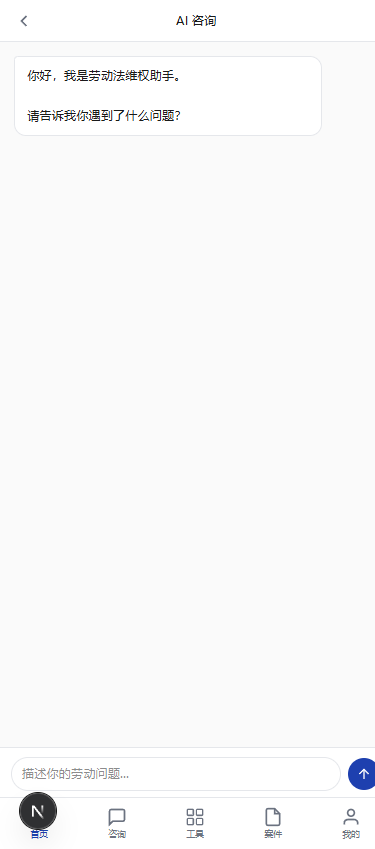
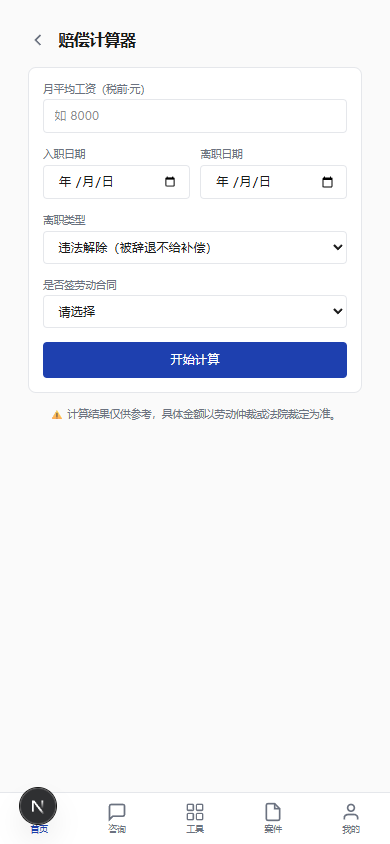

# 劳动法智能维权 AI Agent

[](LICENSE)
[](https://python.org)
[](https://github.com/zzz123123lll/labor-law-ai/stargazers)
[](https://github.com/zzz123123lll/labor-law-ai/commits/master)

面向普通劳动者的 AI 法律维权工具。**输入你的劳动问题，AI 自动分析违法、计算赔偿、生成仲裁文书。** 覆盖从"遇到劳动问题"到"完成仲裁文书"的全流程。

> **⚡ 接入你自己的 AI 即可使用** — 支持 DeepSeek / 通义千问 / 智谱GLM / Moonshot / GPT-4o / 本地 Ollama / 任意 OpenAI 兼容接口。[配置指南 →](./HOW_TO_CONFIGURE_AI.md)

## 预览

| 首页 | AI 咨询 | 赔偿计算 |
|------|---------|----------|
|  |  |  |

---

## 特点

- 🧠 **8 个专业 Agent** — 案件分析、违法识别、赔偿计算、合同审查、证据分析、文书起草、仲裁指导、维权路线
- 📜 **内置法律库** — 劳动法/劳动合同法/社保法/调解仲裁法条文 + 案例索引
- 🤖 **可替换 AI** — 支持 DeepSeek / 通义千问 / GLM / GPT / Ollama 等任意 OpenAI 兼容接口
- 📱 **响应式 Web** — 移动端底部 Tab + PC 端顶部导航
- 📊 **管理后台** — 用户管理、案件查看、数据面板

## 3 分钟上手

```bash
# 1. 安装依赖
cd fastapi-server && pip install -e ".[dev]"

# 2. 配置 AI（任选一个）
cp .env.example .env
# 编辑 .env，填入 LLM_API_KEY

# 3. 启动后端
uvicorn app.main:app --reload

# 4. 启动前端（另一个终端）
cd ../web-app && npm install && npm run dev
```

浏览器打开 `http://localhost:3000`

## 切换 AI 模型

改 `.env` 即可，**不需要改任何代码**：

```env
# DeepSeek
LLM_PROVIDER=deepseek
LLM_API_KEY=sk-your-key
LLM_BASE_URL=https://api.deepseek.com
LLM_MODEL=deepseek-chat

# 通义千问（示例）
# LLM_PROVIDER=qwen
# LLM_API_KEY=sk-your-key
# LLM_BASE_URL=https://dashscope.aliyuncs.com/compatible-mode/v1
# LLM_MODEL=qwen-plus
```

详见 [HOW_TO_CONFIGURE_AI.md](./HOW_TO_CONFIGURE_AI.md)

## 技术栈

| 层 | 技术 |
|---|---|
| 前端 | Next.js 15 + Tailwind v4 |
| 后端 | Python FastAPI |
| AI 层 | 可替换适配器（OpenAI 兼容接口） |
| 数据库 | SQLite（开发）/ PostgreSQL 17（生产） |
| OCR | PaddleOCR |
| 部署 | Docker Compose + Nginx |

## 项目结构

```
labor-law-ai/
├── fastapi-server/
│   ├── app/
│   │   ├── ai/              # LLM 适配器层（接入你自己的 AI）
│   │   ├── agents/          # 8 个劳动法 Agent
│   │   ├── legal_engine/    # 法律条文库（YAML + 内存索引）
│   │   ├── api/             # REST API 路由
│   │   ├── models/          # SQLAlchemy 数据模型
│   │   └── schemas/         # Pydantic 请求/响应
│   └── tests/               # 44 个测试
├── web-app/                 # 用户端（Next.js）
├── admin-panel/             # 管理后台（Next.js + Ant Design）
├── DESIGN.md                # 设计系统
└── HOW_TO_CONFIGURE_AI.md   # AI 配置指南
```

## 已内置的专业化内容

| 模块 | 内容 |
|------|------|
| 法律条文 | 31 条（劳动法/劳动合同法/社保法/调解仲裁法）YAML 格式 |
| Agent Prompt | 8 个领域完整中文 System Prompt |
| 赔偿公式 | 双倍工资 / 经济补偿 N / 违法解除 2N / 加班费 1.5x-3x |
| 文书模板 | 仲裁申请书 / 投诉信 / 证据清单 |
| 违法检测 | 工资/合同/辞退/加班/社保 5 类自动识别 |
| 案例匹配 | 标签 + 关键词检索框架 |

## 功能状态

| 模块 | 状态 |
|------|------|
| AI 咨询对话 | ✅ SSE 流式 |
| 违法识别 | ✅ 8 Agent 就绪 |
| 赔偿计算 | ✅ 公式 + 表格输出 |
| 案件管理 | ✅ CRUD + JSONB 画像 |
| 合同审查 | ✅ 上传 + OCR + AI 审查 |
| 证据分析 | ✅ 上传 + OCR + 强度评分 |
| 文书生成 | ✅ Markdown 输出 |
| 用户认证 | ✅ 微信 OAuth + JWT |
| 支付系统 | ✅ 三档定价（Mock） |
| 管理后台 | ✅ Dashboard + 用户 + 案件 |
| PDF 下载 | ⏳ 待实现 |
| DeepSeek 实测 | ⏳ 待配 API Key |

## 免责声明

**本系统不替代律师正式法律意见。** 所有 AI 分析结果仅供用户参考。
涉及重大权益的法律事务，请务必咨询执业律师。
